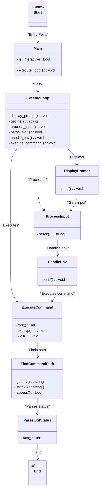

# Simple Shell

A simple Unix-like shell program written in C. This project is designed to provide a basic implementation of a shell that can execute commands, handle user input, and interact with the operating system in a minimalistic manner.

### Features

- Execute basic shell commands (e.g., `ls`, `echo`, etc.)
- Support for environment variable display (`env`)
- Process management with `fork()`, `exec()`, and `wait()`
- Handles input and output redirection (`>`, `<`)
- Customizable prompt

### Requirements

- A Unix-like operating system (Linux or macOS)
- C compiler (e.g., `gcc`)
- Basic understanding of C programming and shell concepts

### Installation

1. Clone the repository to your local machine:

   ```bash
   git clone https://github.com/batrivieredev/holbertonschool-simple_shell.git
   ```

2. Navigate to the project directory:

   ```bash
   cd holbertonschool-simple_shell
   ```

3. Compile the program using `gcc`:

   ```bash
   gcc -Wall -Werror -Wextra -pedantic -std=gnu89 *.c -o hsh
   ```

4. Run the shell:

   ```bash
   ./hsh
   ```

### Usage

Once the shell is running, you will see a prompt (e.g., `Ibrahim and Baptiste's Shell$ >`). You can enter commands just as you would in a normal shell.

Example:

```bash
$ ls
$ echo "Hello, World!"
```

#### Supported Features:

- **Basic Commands:** You can run standard shell commands like `ls`, `cat`, `pwd`, `echo`, etc.
- **Environment Variables:** Display environment variables using the `env` command.

  Example:

  ```bash
  $ env
  ```

- **Redirection:** You can redirect the input and output of commands using `>` and `<`.

  Example:

  ```bash
  $ echo "Hello, World!" > output.txt
  $ cat < input.txt
  ```

- **Exit Command:** Type `exit` to terminate the shell.

### Flowchart

### Contributing

1. Fork the repository
2. Create a new branch (`git checkout -b feature-branch`)
3. Make your changes
4. Commit your changes (`git commit -am 'Add new feature'`)
5. Push to the branch (`git push origin feature-branch`)
6. Create a new Pull Request

### Authors

- Ibrahim HOUMAIDI
- Baptiste RIVIERE
